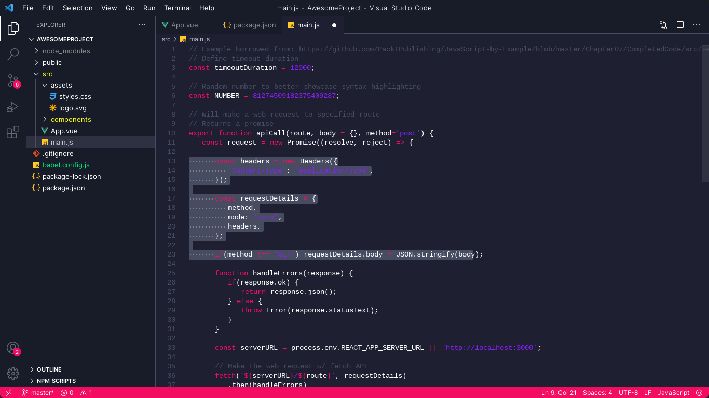
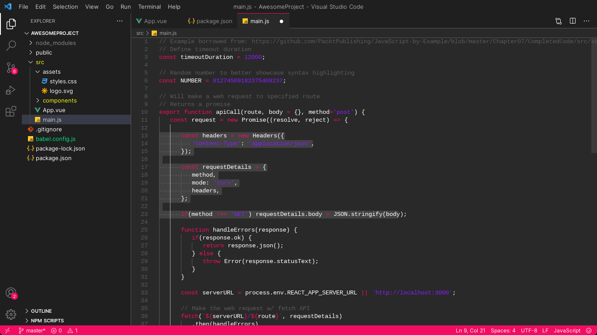

<div align="center">


---

A dark minimalist VS Code theme with a magma touch.
</div>

## 1. Screen

There's two flavours of this theme: **Magma** and **Lava**.
### 1.1 Magma
<div align="center">

</div>

<d>

### 1.2 Lava

<div align="center">

</div>

## 2. Color palette

<div align="center">
  
Palette             | Hex       | RGB           | Preview
---                 | ---       | ---           | ---
Backgroud Black     | `#181B28` | `24 27 40`    |
Frontground Black   | `#1e2031` | `30 32 49`    |
Popup Black         | `#252234` | `37 34 52`    |
Grey                | `#474c60` | `71 76 96`    |
Pink Red            | `#f20d63` | `242 13 99`   |
Purple              | `#891fff` | `137 31 255`  |

</div>

## 3. Tech used

* [Theme Studio for VS Code](https://themes.vscode.one/)

## 4. Installation steps

### 4.1 From VS Code

1. Go to extension part on VS Code activy bar;
2. Search for Lucid Volcano theme;
3. Install and **Enjoy!**

### 4.2 Via CLI:

```
code --install-extension marcosgabriel.lucid-volcano
```

# 5. Extras

To make it even prettier, you can make some changes to your `seetings.json` file. First, press `Ctrl + Shift + P`. Then, choose `Preferences: Open User Seetings` and
paste the following information into your `seetings.json` file.

```json
{
  "workbench.colorCustomizations": {
      "notebook.focusedCellBorder":"#f20d63",
      "notebook.focusedEditorBorder": "#f20d63",
  },
  "notebook.cellToolbarLocation": {
      "default": "right",
      "jupyter-notebook": "left"
  },
}
```
