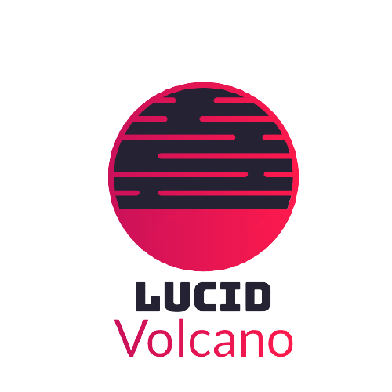
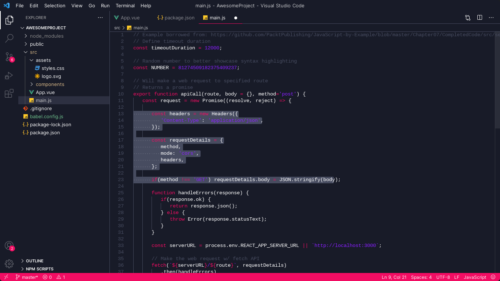
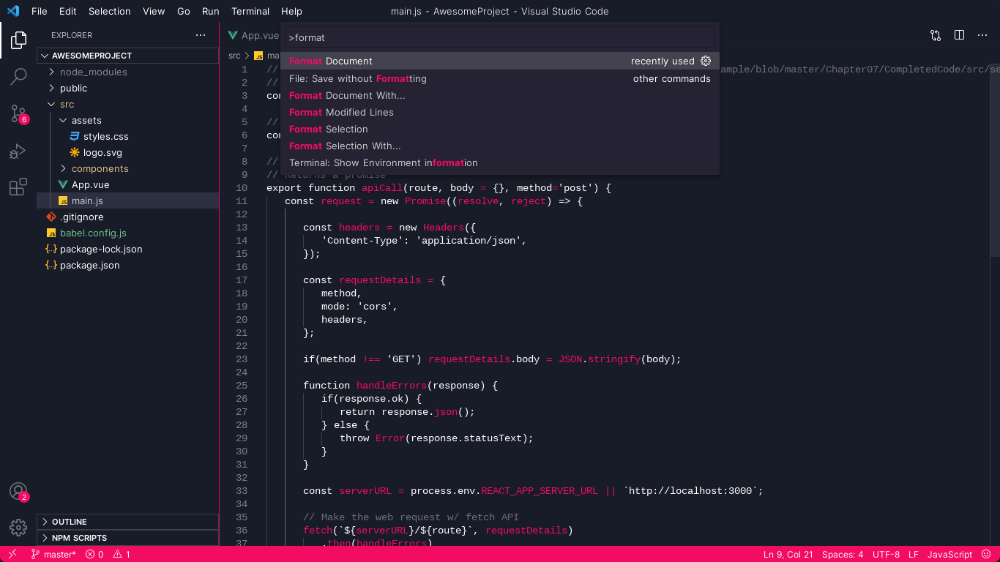

<div align="center">



---

A dark minimalist VS Code theme with a magma touch.





</div>

## Color palette

<div align="center">
  
Palette        | Hex       | RGB         | Preview
---            | ---       | ---         | ---
Darkish Black  | `#181B28` | `24 27 40`  |
Dark Black     | `#252234` | `37 34 52`  |
Grey           | `#474c60` | `71 76 96`  |
Pink Red       | `#f20d63` | `242 13 99` |

</div>

## Tech used

* [Theme Studio for VS Code](https://themes.vscode.one/)

## Installation steps

### From VS Code

1. Go to extension part on VS Code activy bar;
2. Search for Lucid Volcano theme;
3. Install and **Enjoy!**

### Via CLI:

```
code --install-extension marcosgabriel.lucid-volcano
```
